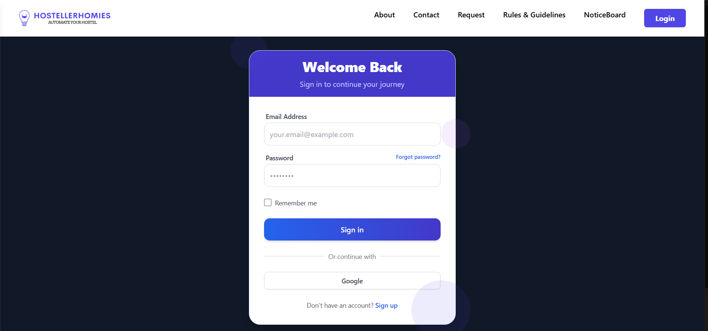
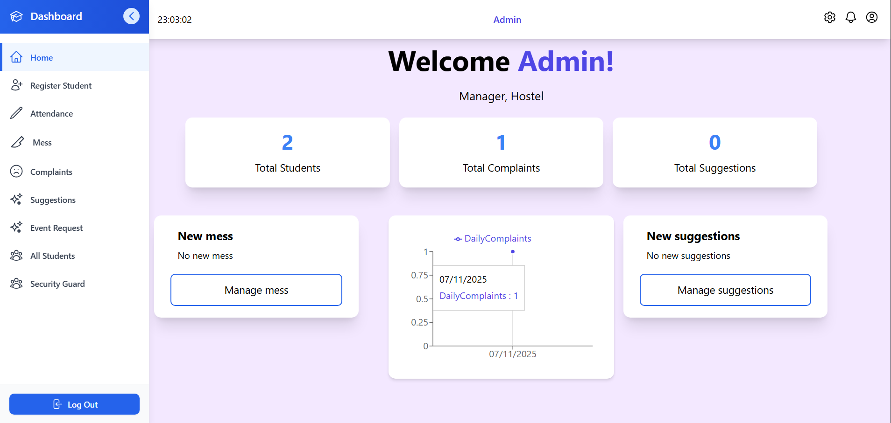
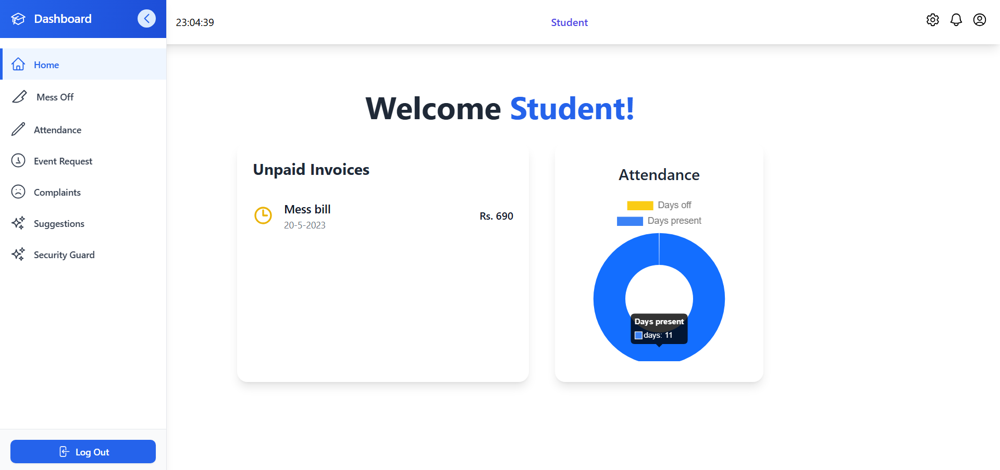
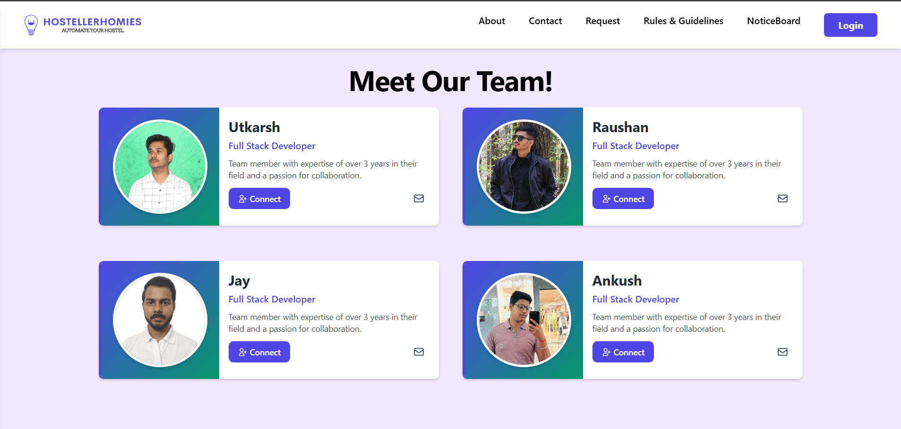

# 🏠 Hosteller Homies

A smart hostel and mess management system designed to streamline student and admin workflows within hostels. Built using the **MERN stack** and deployed on **Render** (backend) and **Vercel** (frontend).

> 🚨 **Note:** Since the backend is hosted on Render, it may take a few moments to respond.

---

## 🔗 Live Website

🌐 [https://hosteller-homies-two.vercel.app](https://hosteller-homies-two.vercel.app)

---

## 🔐 Credentials

### 👨‍🏫 Admin Login
- **Email:** `admin@gmail.com`
- **Password:** `123456789`

### 👨‍🎓 Student Login
- **Email:** `student@gmail.com`
- **Password:** `123456789`

> ✨ Students cannot sign up themselves. Their accounts are created by the mess manager/admin for **security** reasons. Signup and Google login are part of the **future scope**.

---

## 🧠 Features

### ✅ Admin Dashboard
- Home
- Register Student
- Attendance
- Mess
- Complaints
- Suggestions
- Event Request
- All Students
- Security Guard

### 👤 Student Dashboard
- Home
- Mess Off
- Attendance
- Event Request
- Complaints
- Suggestions
- Security Guard

---

## 🖼️ Screenshots

### 🔑 Login Page

 <!-- Replace with your actual image path -->

### 🛠 Admin Dashboard

 <!-- Replace with your actual image path -->

### 🛠 Student Dashboard

 <!-- Replace with your actual image path -->

### 🛠 Meet Team

 <!-- Replace with your actual image path -->

---

## 🚀 Tech Stack

- **Frontend:** React + Vite + Tailwind CSS
- **Backend:** Node.js + Express
- **Database:** MongoDB (MongoDB Atlas)
- **Hosting:** 
  - Frontend: Vercel
  - Backend: Render

---

## 📌 Future Scope

- Google Authentication
- Student Signup (with approval)
- QR Code Integration
- Chat with Security/Support
- Improved Analytics and Charts

---
This is a **team project** built by 4 members as part of our minor project.  
For deployment and testing purposes, it is **hosted individually by Jay** to avoid potential errors caused by uncontrolled parallel updates.  
> ✅ This ensures smooth operation and stability for demo/testing.

## 👥 Authors

| Name      | GitHub Profile                                    |
|-----------|----------------------------------------------------|
| Raushan   | [@CoderRaushan](https://github.com/CoderRaushan)  |
| Jay       | [@jayjaisswal](https://github.com/jayjaisswal)    |
| Ankush    | [@ankushkumar2122](https://github.com/ankushkumar2122) |
| Utkarsh   | [@u4utkarsh](https://github.com/u4utkarsh)         |

**Team GitHub Repo**: [https://github.com/CoderRaushan/HostellerHomies](https://github.com/CoderRaushan/HostellerHomies)

> This is a **minor project**, but will be continued as a **major project** in the future.

---

## 📄 License

This project is licensed for academic and educational purposes.

